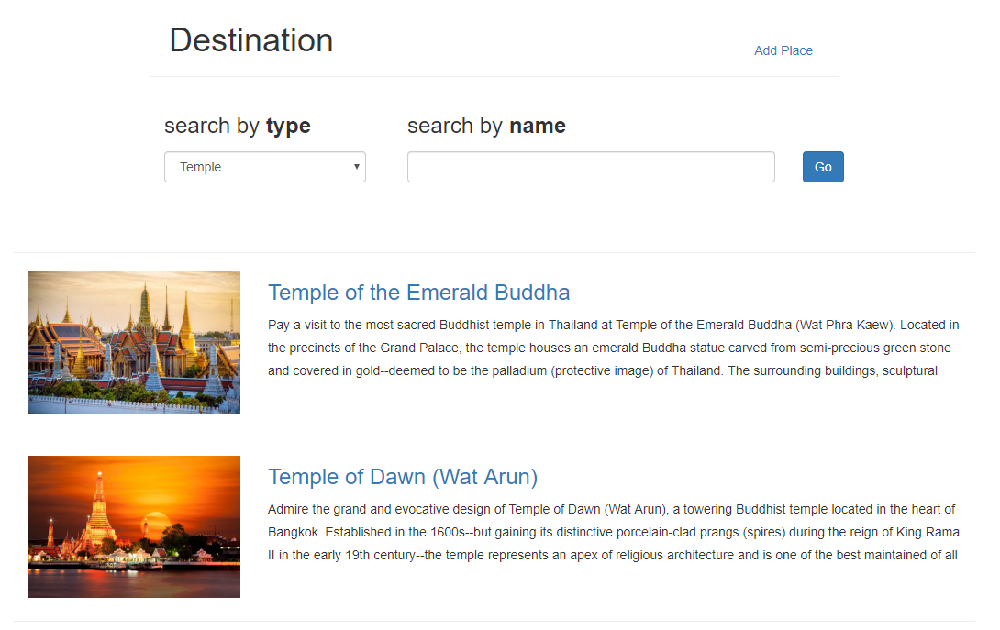
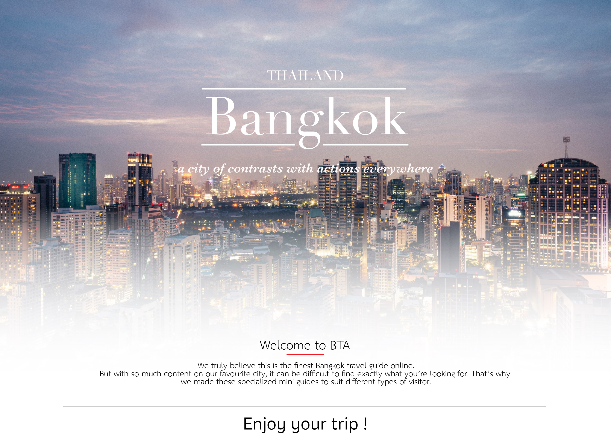

# BTA : Bangkok Travel Assistance

> Traveling and planning Website for foreigners who are interested to travel in Bangkok.

 

## User 
  - Add places to favourite
  - Add event 
  - Route
    - Add route
	- Review and rate route
## Admin management
  - In order to get to admin page navigate to 
  /admin
  - Add/Verifies places or event from the user.

## Install and Run?
1. Run __`npm install`__ to install dependencies.
2. Run the server by open file server.js using the command :
#### `npm start`
3. Run the webpage(angular) on another terminal run:
#### `ng serve`
4. Open __[http://localhost:4200](http://localhost:4200)__
5. Enjoy!!

### LIVE SERVER: 
  - [https://teepobharu.github.io/btaapp](https://teepobharu.github.io/btaapp)
  - [https://btaweb.herokuapp.com](https://btaweb.herokuapp.com)

----------------
Production Build Notes
  1. use script `npm run ghp` (build to github pages) followed by `ngh --dir=dist/BTA` (deploy)
  2. Continuous Deployment via Heroku by `git push`

